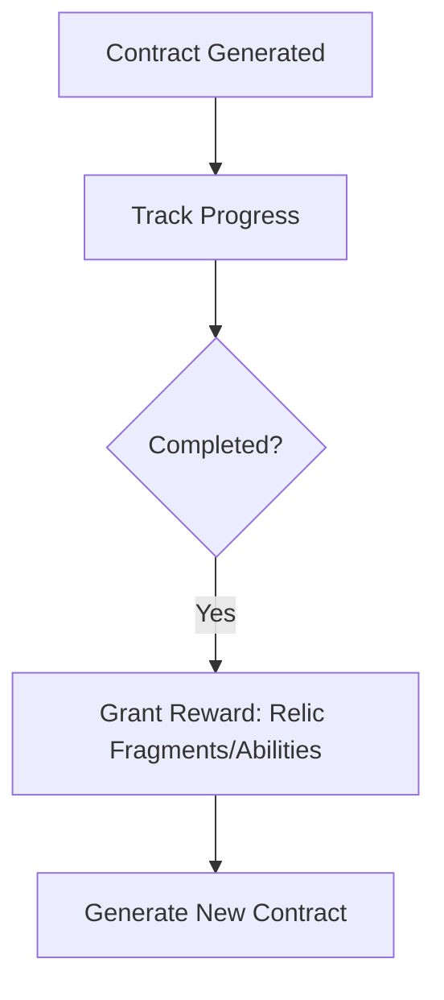

### **PROJECT BRIEF: "SHATTERED EXPANSE"**  
**For AI Coding Agent Implementation (Love2D Engine)**  

---

### **1. CORE CONCEPT**  
**Genre**: Roguelite Open-World Exploration  
**Objective**: Create a tile-based game where players explore procedurally generated biomes, complete exploration contracts, and unlock meta-progression through permadeath cycles. Combat is minimal; focus is on risk/reward exploration.

---

### **2. TECHNICAL SPECIFICATIONS**  
**Engine**: Love2D (Lua)  
**Dependencies**:  
- `perlin.lua` (procedural generation)  
- `serpent.lua` (save/load serialization)  
**Grid System**: 200x200 world (1 tile = 32px)  

---

### **3. GAME STATE STRUCTURE**  
```lua
GameState = {
  world = {  -- Generated each run
    width = 200,
    height = 200,
    tiles = {}  -- 2D array [x][y]
  },
  
  player = {
    x = 1, y = 1,
    stamina = 100,
    inventory = {
        torch = 3, 
        rope = 2,
        relic_fragments = {} -- e.g., {time = 2, space = 1}
    },
    abilities = {}
  },
  
  contracts = {
    active = {},  -- Current objectives
    completed = 0
  },
  
  meta = {  -- Persists across runs
    unlocked_abilities = {"basic_map"},
    banked_resources = {crystal = 0},
    discovered_landmarks = {},
    relics = { -- Definition of relics and their reconstruction status
        -- Example: {name = "Chrono Prism", fragments = {time=3, space=2}, reconstructed = false}
    },
    relic_fragments = {} -- Persisted player fragments, e.g. {time = 1}
  }
}
```

---

### **4. WORLD GENERATION REQUIREMENTS**  
**Biome Types**:  
| ID | Name | Risk | Color | Hazard |  
|----|-------|------|----------|---------|  
| 1 | Rusted Oasis | Low | (200,180,100) | None |  
| 2 | Veiled Jungle | Medium | (30,120,40) | 20% stamina drain |  
| 3 | Stormspire Peaks | High | (120,120,140) | 40% stamina drain or reward |  
| 4 | Desert | Low | (194,178,128) | None |
| 5 | Tundra | High | (150,150,180) | Harsh conditions |
| 6 | Impassable Mountain Face | Blocked | (80,80,90) | Impassable without tools |
| 7 | Ancient Path (MST) | Low | (160,140,80) | Strategic pathways |

**Generation Algorithm**:  
```python
1. Initialize 200x200 grid  
2. Generate region-based biome assignment using multiple Perlin noise layers
3. Apply MST (Minimum Spanning Tree) path system connecting regions and landmarks
4. Add environmental barriers and chokepoints
5. Place 40 landmarks with enhanced interaction types:  
   - Types: ["Ancient Ruins", "Mystic Shrine", "Crystal Formation", "Abandoned Camp", 
            "Strange Monolith", "Ancient Obelisk", "Hidden Spring", "Ancient Lever", 
            "Seer's Totem", "Hidden Cache", "Contract_Scroll"]  
   - Advanced landmark interactions (revealing, activating, rewards)
   - Properties: {type, discovered, visited, activated, looted, reveals_landmark_at}  
```

---

### **5. CORE MECHANICS**  
**A. Player Movement**  
- Arrow keys move player 1 tile  
- Each move:  
  - Deduct 10 stamina  
  - Reveal tiles in 3-tile radius  
  - Trigger hazard check  

**B. Hazard System**  
```lua
function checkHazard(player_x, player_y)
  tile = world.tiles[player_x][player_y]
  if tile.biome == 2 and math.random() < 0.2 then
    player.stamina -= 10
  elseif tile.biome == 3 and math.random() < 0.4 then
    if math.random() < 0.7 then player.stamina -= 20
    else player:add_resource("relic_fragment")
  end
end
```

**C. Contracts System**  
**Contract Types**:  
1. `discover_landmark`: Find specific landmark type  
2. `explore_biome`: Reveal X% of biome tiles  
3. `collect_resource`: Gather Y units of resource  

**Contract Discovery**: Contract scrolls can be found at landmarks, generating additional objectives.

**Flow**:  


---

### **6. META-PROGRESSION SYSTEM**  
**Persistent Elements**:  
- Unlocked abilities (e.g., "glide", "hazard_resist")  
- Banked resources (max 1 saved per run)  
- Discovered landmark coordinates
- Collected relic fragments
- Reconstructed relic statuses

**Death Handling**:
```lua
function onPlayerDeath()
  saveToMeta({
    relic_fragments = player.inventory.relic_fragments,
    discovered_landmarks = world.discovered_landmarks,
    unlocked_abilities = player.abilities,
    relics = meta.relics -- Relic reconstruction status
  })
  resetWorld()
  -- Life Spring relic provides stamina boost on respawn
end
```

---

### **7. RENDERING REQUIREMENTS**  
**Visual Rules**:  
```
if tile.explored:
  draw biome_color + landmark_icon if discovered
else:
  draw BLACK
player: RED circle at (x*32, y*32)
```

**UI Elements**:  
- Top-left: Stamina bar (GREEN/YELLOW/RED gradient)  
- Top-right: Active contract description  
- Bottom-left: Inventory counts (including relic fragments by type)
- Bottom-right: Relic Reconstruction UI (shows relic status and fragment requirements)
- Landmark sprites: Visual icons rendered using LÖVE2D drawing primitives
- Notifications: Timed messages for discoveries and events

---

### **8. SAVE/LOAD SYSTEM**  
**Data to Persist**:  
- `meta.unlocked_abilities`  
- `meta.banked_resources`  
- `meta.discovered_landmarks`
- `meta.relics` (status and reconstruction state of each relic)
- `meta.relic_fragments` (persistent fragment counts across runs)

**Operations**:
```lua
function saveGame()
  serialized = serpent.dump(GameState.meta)
  love.filesystem.write("save.dat", serialized)
end

function loadGame()
  if save_exists then
    GameState.meta = serpent.load(love.filesystem.read("save.dat"))
  end
end
```

---

### **9. CURRENT STATE**  
✅ **TECHNICAL FOUNDATION COMPLETE**:
1. Advanced world generation with MST paths, regions, and strategic corridors
2. Player movement with stamina-based hazard system (no default movement cost)
3. Comprehensive relic reconstruction system with passive effects
4. Enhanced landmark interactions (Obelisk-Spring, Ancient Lever, Seer's Totem)
5. Contract system with scroll discovery and relic fragment rewards
6. Visual landmark sprite system using LÖVE2D drawing primitives
7. Meta-progression persistence with robust save/load

🎯 **CURRENT FOCUS - FINDING THE FUN**:
- Identifying which mechanics create genuine player engagement
- Experimenting with reward pacing and progression satisfaction
- Refining core gameplay loop for maximum enjoyment
- Testing different approaches to player motivation and goal-setting

### **10. TEST SCENARIOS**  
```gherkin
Scenario: MST Path Connectivity
  Given a newly generated world
  When examining the map
  Then strategic paths should connect all regions
  And paths should avoid impassable terrain when possible

Scenario: Landmark Navigation (Obelisk-Spring)
  Given an Ancient Obelisk is discovered
  When player visits the Obelisk
  Then linked Hidden Spring location is revealed on map
  And Spring becomes visible in minimap

Scenario: Relic Reconstruction
  Given player has sufficient fragments for a relic
  When pressing 'r' key
  Then relic is reconstructed and fragments are consumed
  And passive effects become active immediately

Scenario: Environmental Barriers
  Given player approaches Impassable Mountain Face
  When attempting to move without climbing picks
  Then movement is blocked with notification
  But with climbing picks, movement is allowed
