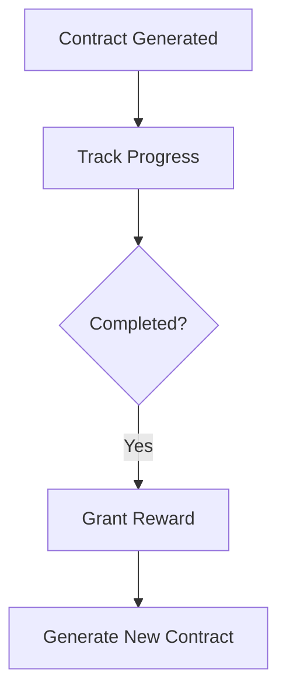

### **PROJECT BRIEF: "SHATTERED EXPANSE"**  
**For AI Coding Agent Implementation (Love2D Engine)**  

---

### **1. CORE CONCEPT**  
**Genre**: Roguelite Open-World Exploration  
**Objective**: Create a tile-based game where players explore procedurally generated biomes, complete exploration contracts, and unlock meta-progression through permadeath cycles. Combat is minimal; focus is on risk/reward exploration.

---

### **2. TECHNICAL SPECIFICATIONS**  
**Engine**: Love2D (Lua)  
**Dependencies**:  
- `perlin.lua` (procedural generation)  
- `serpent.lua` (save/load serialization)  
**Grid System**: 100x100 world (1 tile = 32px)  

---

### **3. GAME STATE STRUCTURE**  
```lua
GameState = {
  world = {  -- Generated each run
    width = 100,
    height = 100,
    tiles = {}  -- 2D array [x][y]
  },
  
  player = {
    x = 1, y = 1,
    stamina = 100,
    inventory = {
        torch = 3, 
        rope = 2,
        relic_fragments = {} -- e.g., {time = 2, space = 1}
    },
    abilities = {}
  },
  
  contracts = {
    active = {},  -- Current objectives
    completed = 0
  },
  
  meta = {  -- Persists across runs
    unlocked_abilities = {"basic_map"},
    banked_resources = {crystal = 0},
    discovered_landmarks = {},
    relics = { -- Definition of relics and their reconstruction status
        -- Example: {name = "Chrono Prism", fragments = {time=3, space=2}, reconstructed = false}
    },
    relic_fragments = {} -- Persisted player fragments, e.g. {time = 1}
  }
}
```

---

### **4. WORLD GENERATION REQUIREMENTS**  
**Biome Types**:  
| ID | Name | Risk | Color | Hazard |  
|----|-------|------|----------|---------|  
| 1 | Rusted Oasis | Low | (200,180,100) | None |  
| 2 | Veiled Jungle | Medium | (30,120,40) | 20% stamina drain |  
| 3 | Stormspire Peaks | High | (120,120,140) | 40% stamina drain or reward |  

**Generation Algorithm**:  
```python
1. Initialize 100x100 grid  
2. Generate Perlin noise map (scale=0.1)  
3. Assign biomes:  
   - noise < 0.3 → Biome 1  
   - 0.3 ≤ noise < 0.6 → Biome 2  
   - noise ≥ 0.6 → Biome 3  
4. Place 20 landmarks:  
   - Types: ["Temple", "Caravan", "Cave", "Monolith"]  
   - At random walkable positions  
   - Properties: {type, discovered, reward_type}  
```

---

### **5. CORE MECHANICS**  
**A. Player Movement**  
- Arrow keys move player 1 tile  
- Each move:  
  - Deduct 10 stamina  
  - Reveal tiles in 3-tile radius  
  - Trigger hazard check  

**B. Hazard System**  
```lua
function checkHazard(player_x, player_y)
  tile = world.tiles[player_x][player_y]
  if tile.biome == 2 and math.random() < 0.2 then
    player.stamina -= 10
  elseif tile.biome == 3 and math.random() < 0.4 then
    if math.random() < 0.7 then player.stamina -= 20
    else player:add_resource("relic_fragment")
  end
end
```

**C. Contracts System**  
**Contract Types**:  
1. `discover_landmark`: Find specific landmark type  
2. `explore_biome`: Reveal X% of biome tiles  
3. `collect_resource`: Gather Y units of resource  

**Flow**:  


---

### **6. META-PROGRESSION SYSTEM**  
**Persistent Elements**:  
- Unlocked abilities (e.g., "glide", "hazard_resist")  
- Banked resources (max 1 saved per run)  
- Discovered landmark coordinates
- Collected relic fragments
- Reconstructed relic statuses

**Death Handling**:
```lua
function onPlayerDeath()
  saveToMeta({
    resources = player.inventory.most_valuable,
    landmarks = world.newly_discovered_landmarks
  })
  resetWorld()
end
```

---

### **7. RENDERING REQUIREMENTS**  
**Visual Rules**:  
```
if tile.explored:
  draw biome_color + landmark_icon if discovered
else:
  draw BLACK
player: RED circle at (x*32, y*32)
```

**UI Elements**:  
- Top-left: Stamina bar (GREEN/YELLOW/RED gradient)  
- Top-right: Active contract description  
- Bottom-right: Inventory counts
- Bottom-right (new): Relic Reconstruction UI (shows relic status and fragment requirements)

---

### **8. SAVE/LOAD SYSTEM**  
**Data to Persist**:  
- `meta.unlocked_abilities`  
- `meta.banked_resources`  
- `meta.discovered_landmarks`
- `meta.relics` (status of each relic)
- `meta.relic_fragments` (player's collected fragments)

**Operations**:
```lua
function saveGame()
  serialized = serpent.dump(GameState.meta)
  love.filesystem.write("save.dat", serialized)
end

function loadGame()
  if save_exists then
    GameState.meta = serpent.load(love.filesystem.read("save.dat"))
  end
end
```

---

### **9. DEVELOPMENT PRIORITIES**  
1. World generation + rendering  
2. Player movement + fog of war  
3. Hazard system  
4. Contract tracking  
5. Meta-progression persistence  
6. UI implementation  

---

### **10. TEST CASES**  
```gherkin
Scenario: Biome Hazard Trigger
  Given player is in Veiled Jungle
  When player moves to new tile
  Then 20% chance to lose 10 stamina

Scenario: Contract Completion
  Given "Find Temple" contract
  When player discovers Temple landmark
  Then contract marked complete
  And "glide" ability unlocked

Scenario: Death Sequence
  Given player has 5 crystals
  When stamina reaches 0
  Then crystals saved to meta
  And new world generated
