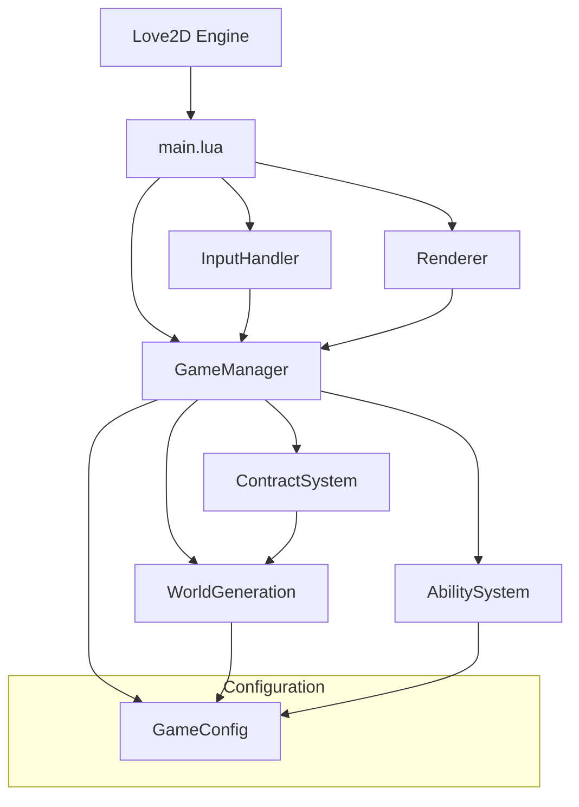
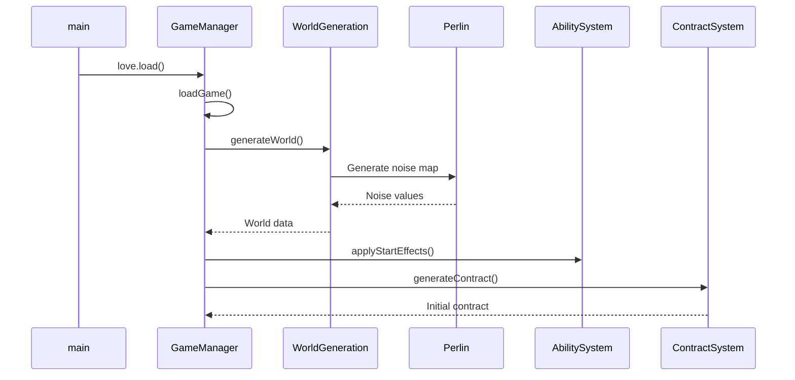
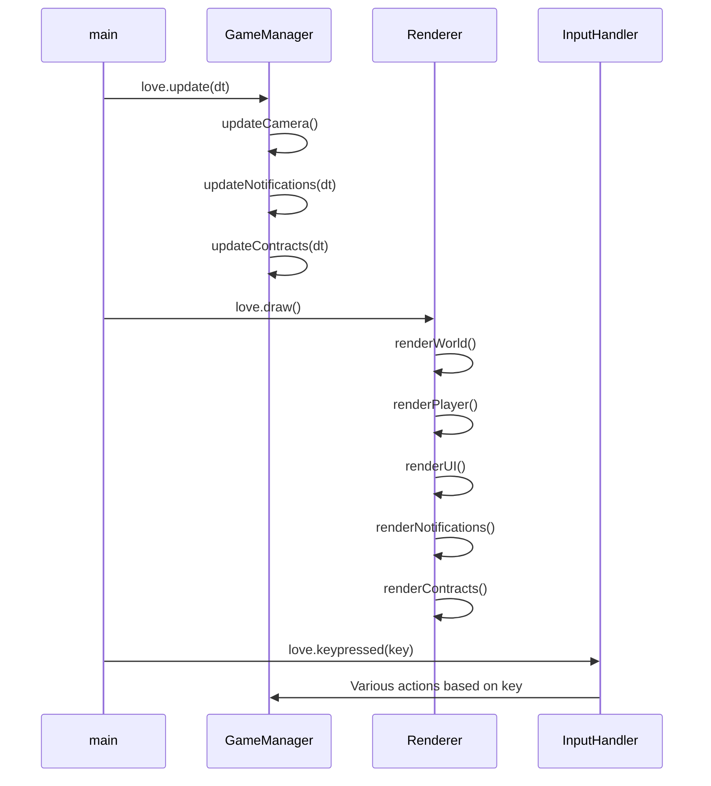
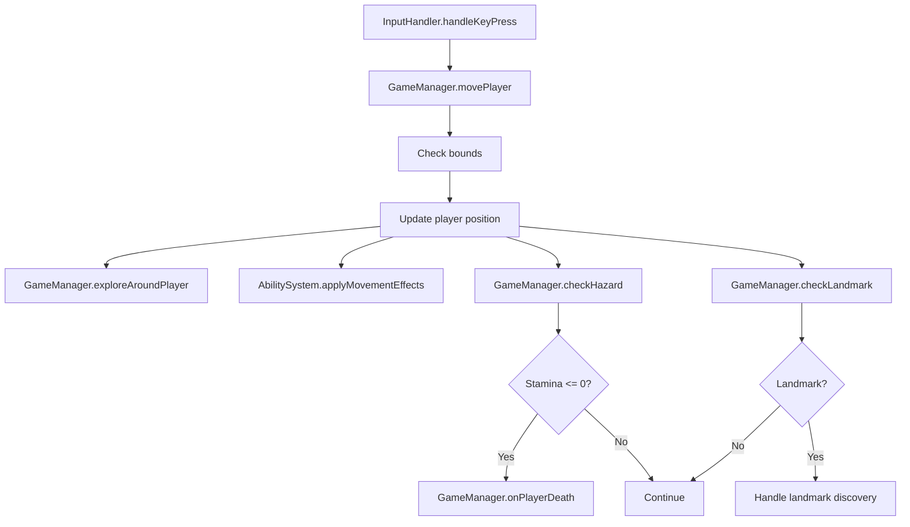
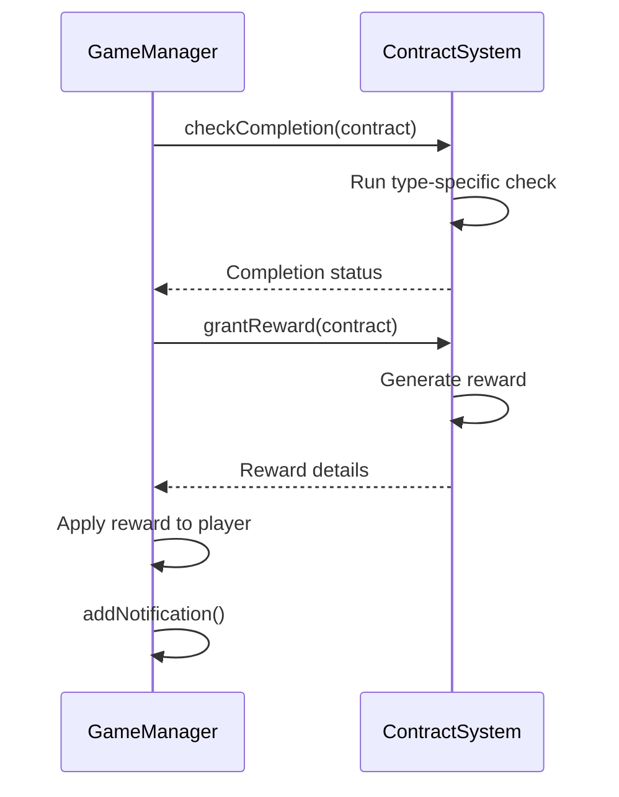

### **SYSTEM PATTERNS: "SHATTERED EXPANSE"**

---

### **ARCHITECTURE OVERVIEW**


The codebase now follows a modular architecture with clear separation of concerns:

```
/
├── lib/                      # External libraries and dependencies
│   ├── perlin.lua            # Perlin noise implementation for procedural generation
│   └── serpent.lua           # Serialization library for save/load
├── src/                      # Source code
│   ├── config/               # Configuration settings
│   │   └── game_config.lua   # Centralized game constants and settings
│   ├── core/                 # Core game systems
│   │   └── game_manager.lua  # Game state and management
│   ├── input/                # Input handling
│   │   └── input_handler.lua # Processes user input
│   ├── rendering/            # Rendering systems
│   │   └── renderer.lua      # Handles all rendering operations
│   ├── systems/              # Game systems
│   │   ├── ability_system.lua # Player abilities and effects
│   │   └── contract_system.lua # Contract generation and management
│   ├── world/                # World-related code
│   │   └── world_generation.lua # Procedural world generation
│   └── ui/                   # User interface components
├── main.lua                  # Entry point and LÖVE callbacks
└── documentation/            # Documentation files
    └── ai_development_guide.md # Developer guide
```

---

### **KEY TECHNICAL DECISIONS**
1. **Modular Architecture**
   - Separation of concerns with focused modules
   - Centralized configuration in game_config.lua
   - Explicit module dependencies for better traceability
   - Comprehensive documentation for AI maintainability

2. **Procedural Generation**
   - Enhanced Perlin noise implementation for biome distribution
   - Random landmark placement with walkability checks
   - Tile-based world representation (100x100 grid)
   - Configurable generation parameters

3. **Game State Management**
   - Centralized `GameState` table within GameManager
   - Separation of run-specific state and persistent meta-state
   - Serialization using Serpent library
   - Clear state update functions

4. **Progression Systems**
   - Relic reconstruction as long-term goal
   - Exploration-focused ability unlocks
   - Contract rewards tied to progression
   - Meta-progression across gameplay sessions

5. **Systems Design**
   - Decoupled systems: Movement, Hazard, Contract, Progression, Ability
   - Event-driven hazard system triggered on movement
   - Observer pattern for contract completion events
   - Factory pattern for ability effects

6. **Rendering Architecture**
   - Dedicated Renderer module with specialized rendering functions
   - Clear separation between game logic and presentation
   - Organized rendering of world, UI, notifications, and contracts

---

### **DESIGN PATTERNS**
1. **Module Pattern**
   - Each component is a self-contained Lua module
   - Public API exposed through returned table
   - Private functions kept within module scope
   - Example: 
   ```lua
   local MyModule = {}
   function MyModule.publicFunction() end
   local function privateFunction() end
   return MyModule
   ```

2. **Centralized State Management**
   - GameManager.GameState serves as the source of truth
   - Components read from but don't directly modify state
   - State modifications go through GameManager functions
   - Prevents state inconsistencies and race conditions

3. **Centralized Configuration**
   - All constants and magic numbers in game_config.lua
   - Organized by domain (WORLD, PLAYER, HAZARDS, UI)
   - Makes tweaking game parameters easier
   - Improves maintainability by removing hardcoded values

4. **Observer Pattern**
   - Contract system observes player discoveries
   - Hazard system observes player movement
   - Ability system observes player actions
   - Notification system for game events

5. **Strategy Pattern**
   - Different hazard implementations per biome
   - Different contract types with unique completion criteria
   - Configurable ability effects
   - Flexible rendering strategies based on view mode

6. **Factory Pattern**
   - Generates contract rewards (relic fragments, abilities)
   - Creates ability effect implementations
   - Procedurally generates world features

---

### **CRITICAL IMPLEMENTATION PATHS**
1. **Initialization Flow**


2. **Game Loop Execution**


3. **Player Movement Flow**


4. **Contract System Flow**


5. **Death and Persistence Flow**
```mermaid
flowchart TD
    A[Stamina <= 0] --> B[GameManager.onPlayerDeath]
    B --> C[Save relic fragments to meta]
    C --> D[Save discovered landmarks]
    D --> E[GameManager.saveGame]
    E --> F[Reset world/player]
    F --> G[Load persistent abilities]
    G --> H[Reset contracts]
    H --> I[Continue game]
