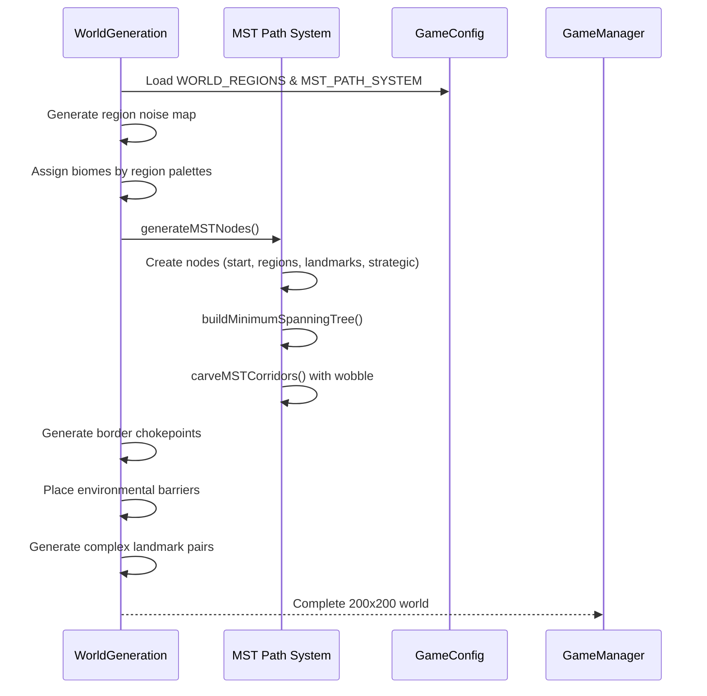
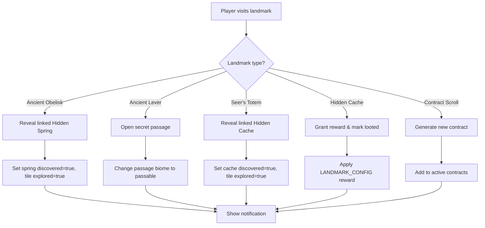
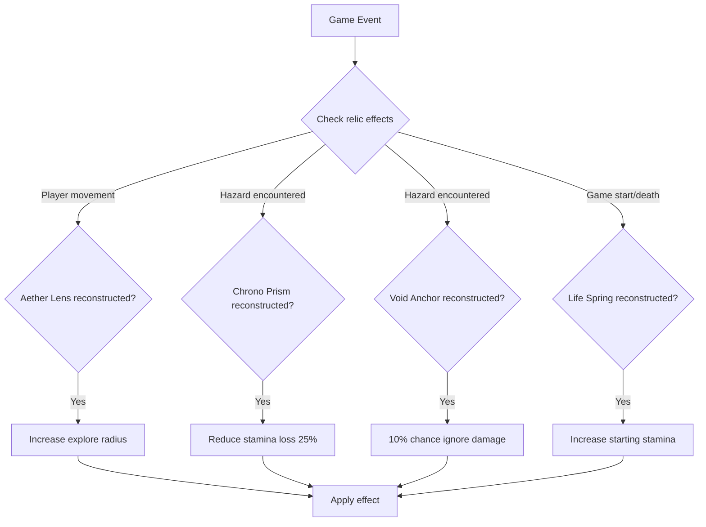
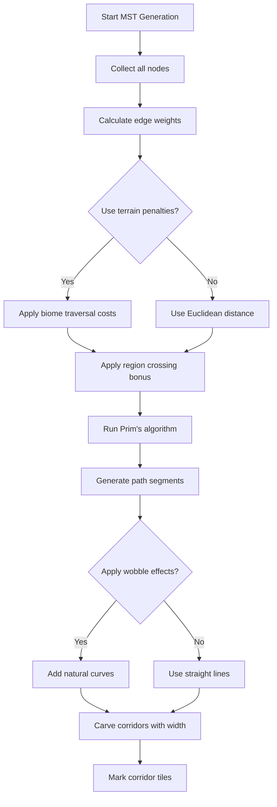
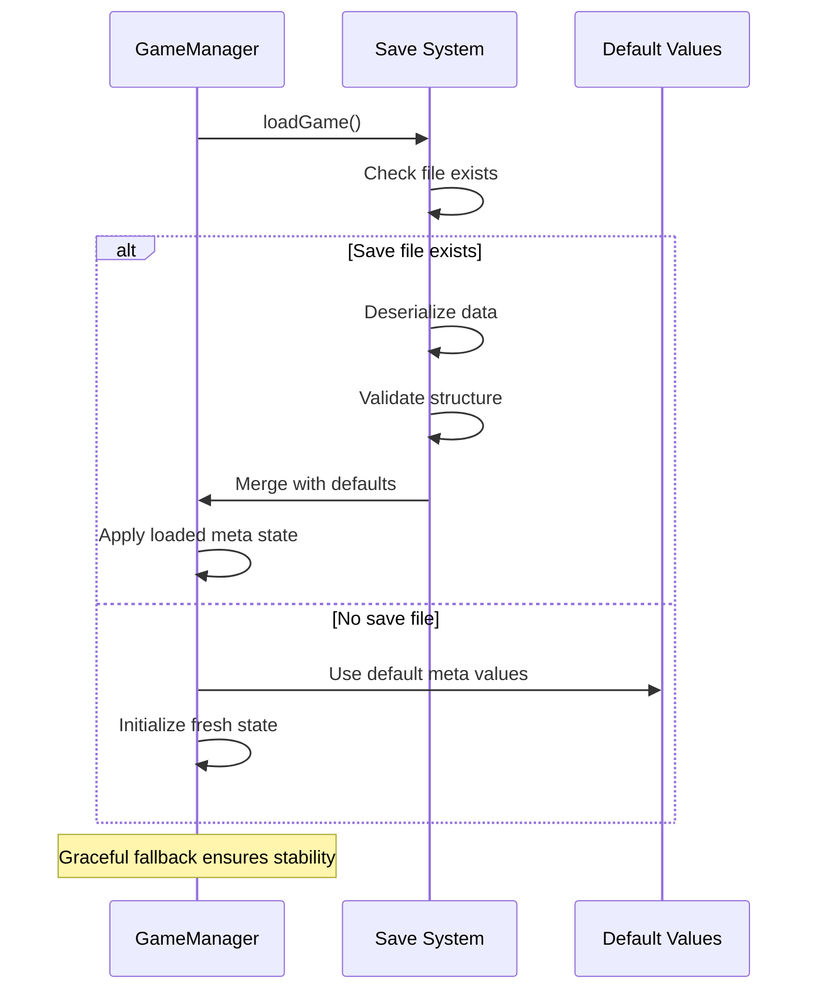

### **SYSTEM PATTERNS: "SHATTERED EXPANSE"**

---

### **ARCHITECTURE OVERVIEW**
```mermaid
graph TD
    A[Love2D Engine] --> B[main.lua]
    B --> C[GameManager]
    B --> D[InputHandler]
    B --> E[Renderer]
    
    C --> F[WorldGeneration]
    C --> G[AbilitySystem]
    C --> H[ContractSystem]
    C --> I[GameConfig]

    D --> C
    E --> C
    E --> I

    F --> I
    G --> I
    H --> F
    
    subgraph Core_Systems
        C[GameManager - Central State Management]
        F[WorldGeneration - MST Paths & Regions]
        E[Renderer - Visual System & Sprites]
        D[InputHandler - User Input Processing]
        I[GameConfig - Centralized Configuration]
    end
    
    subgraph GameManager_Functions
        C_init[initialize - Setup & Life Spring effect]
        C_save[saveGame - Meta persistence]
        C_load[loadGame - Robust loading with defaults]
        C_death[onPlayerDeath - Relic fragment persistence]
        C_move[movePlayer - Movement & hazard checking]
        C_landmark[checkLandmark - Complex landmark interactions]
        C_attempt_relic[attemptRelicReconstruction]
        C_debug_suite[Debug Tools Suite - f1-f4 keys]
        C_is_relic[isRelicReconstructed - Passive effect queries]
        C_explore[exploreAroundPlayer - Aether Lens integration]
        C_hazard[checkHazard - Chrono Prism & Void Anchor effects]
    end
    
    subgraph WorldGeneration_Systems
        WG_mst[MST Path Generation]
        WG_regions[Region-Based Biomes]
        WG_landmarks[Complex Landmark Placement]
        WG_barriers[Environmental Barriers]
        WG_corridors[Strategic Corridors]
    end
    
    subgraph Rendering_Systems
        R_sprites[Data-Driven Landmark Sprites (Sprite Sheet)]
        R_ui[Multi-Panel UI System]
        R_views[Dual View Modes]
        R_notifications[Notification System]
    end
```

The codebase now follows a modular architecture with clear separation of concerns:

```
/
├── lib/                      # External libraries and dependencies
│   ├── perlin.lua            # Perlin noise implementation for procedural generation
│   └── serpent.lua           # Serialization library for save/load
├── src/                      # Source code
│   ├── config/               # Configuration settings
│   │   └── game_config.lua   # Centralized game constants and settings
│   ├── core/                 # Core game systems
│   │   └── game_manager.lua  # Game state and management
│   ├── input/                # Input handling
│   │   └── input_handler.lua # Processes user input
│   ├── rendering/            # Rendering systems
│   │   └── renderer.lua      # Handles all rendering operations
│   ├── systems/              # Game systems
│   │   ├── ability_system.lua # Player abilities and effects
│   │   └── contract_system.lua # Contract generation and management
│   ├── world/                # World-related code
│   │   └── world_generation.lua # Procedural world generation
│   └── ui/                   # User interface components
├── main.lua                  # Entry point and LÖVE callbacks
└── documentation/            # Documentation files
    └── ai_development_guide.md # Developer guide
```

---

### **KEY TECHNICAL DECISIONS**
1. **Advanced Modular Architecture**
   - **Complete separation of concerns** across 8 focused modules
   - **Centralized configuration system** in game_config.lua with 400+ parameters
   - **Explicit dependency management** for clear module relationships
   - **AI-first documentation** with comprehensive memory bank system
   - **Debug-driven development** with extensive testing infrastructure

2. **Sophisticated Procedural Generation**
   - **Multi-algorithm world generation:**
     - **Region-based biome palettes** using dual Perlin noise layers
     - **MST Path Generation** with Prim's algorithm for optimal connectivity
     - **Terrain-aware pathfinding** with biome penalties and region bonuses
     - **Organic path appearance** with wobble effects and natural curves
     - **Environmental barriers** requiring specific tools/abilities
   - **200x200 world scale** with performance optimizations
   - **Complex landmark relationships** (11 types with interactions)
   - **Strategic corridor system** connecting safe regions
   - **Configurable generation parameters** for easy tweaking

3. **Robust State Management**
   - **Centralized GameState** with clear run vs. meta-state separation
   - **Fragment-based progression** with persistent relic reconstruction
   - **Graceful save/load system** with default value merging
   - **Death state handling** preserving player progress
   - **Real-time state validation** ensuring data consistency

4. **Comprehensive Progression Systems**
   - **Four-relic reconstruction system** with passive effects
   - **Contract-based exploration** with scroll discovery mechanics
   - **Stamina-based challenge** without punitive movement costs
   - **Multi-layered rewards** (fragments, abilities, items)
   - **Cross-session persistence** maintaining long-term progression

5. **Advanced Systems Integration**
   - **Decoupled but interconnected** systems with clear interfaces
   - **Event-driven interactions** for landmark discoveries
   - **Passive effect system** for relic bonuses
   - **Complex landmark behaviors** (revealing, activating, transforming)
   - **Performance-optimized** contract checking and world updates

6. **Data-Driven Visual System**
   - **Sprite-based landmark rendering** using sprite sheets and quads
   - **Multi-panel UI architecture** with contextual information
   - **Dual view mode system** (zoomed + minimap)
   - **Real-time notification system** with timing and fade effects
   - **Configuration-driven visuals** requiring no art assets

---

### **DESIGN PATTERNS**
1. **Module Pattern**
   - Each component is a self-contained Lua module
   - Public API exposed through returned table
   - Private functions kept within module scope
   - Example: 
   ```lua
   local MyModule = {}
   function MyModule.publicFunction() end
   local function privateFunction() end
   return MyModule
   ```

2. **Centralized State Management**
   - GameManager.GameState serves as the source of truth
   - Components read from but don't directly modify state
   - State modifications go through GameManager functions
   - Prevents state inconsistencies and race conditions

3. **Centralized Configuration**
   - All constants and magic numbers in game_config.lua
   - Organized by domain (WORLD, PLAYER, HAZARDS, UI)
   - Makes tweaking game parameters easier
   - Improves maintainability by removing hardcoded values

4. **Observer Pattern**
   - Contract system observes player discoveries
   - Hazard system observes player movement
   - Ability system observes player actions
   - Notification system for game events

5. **Strategy Pattern**
   - Different hazard implementations per biome
   - Different contract types with unique completion criteria
   - Configurable ability effects
   - Flexible rendering strategies based on view mode

6. **Factory Pattern**
   - Generates contract rewards (relic fragments, abilities)
   - Creates ability effect implementations
   - Procedurally generates world features

---

### **CRITICAL IMPLEMENTATION PATHS**
### **CRITICAL IMPLEMENTATION FLOWS**

1. **Advanced World Generation Flow**


2. **Complex Landmark Interaction Flow**


3. **Relic Effect Integration Flow**


4. **MST Path Generation Algorithm**


5. **Save/Load Robustness Flow**

