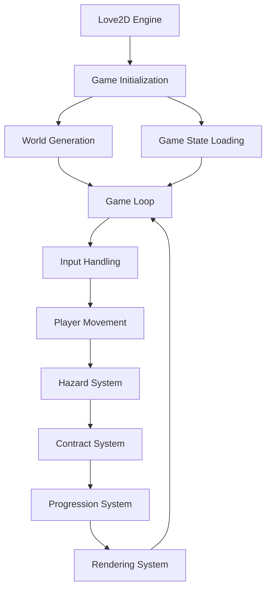
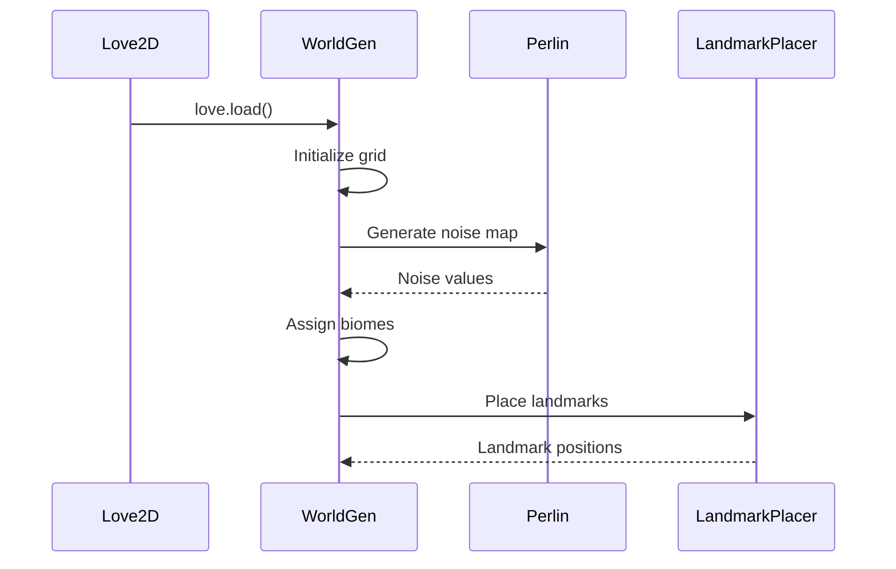
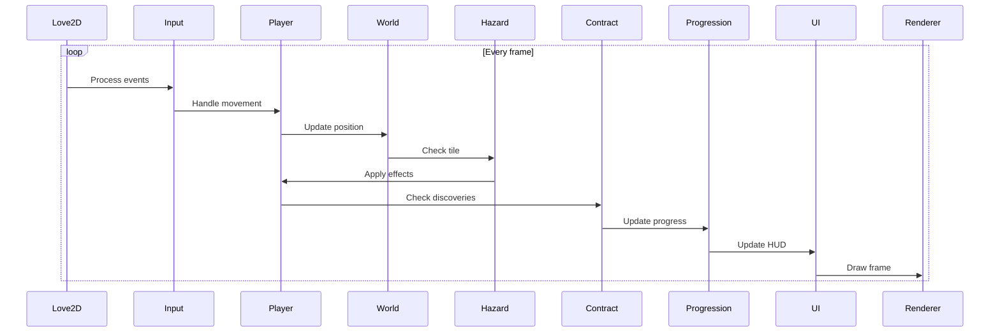

### **SYSTEM PATTERNS: "SHATTERED EXPANSE"**

---

### **ARCHITECTURE OVERVIEW**


---

### **KEY TECHNICAL DECISIONS**
1. **Procedural Generation**
   - Custom Perlin noise implementation for biome distribution
   - Random landmark placement with walkability checks
   - Tile-based world representation (100x100 grid)
2. **Game State Management**
   - Single global `GameState` table
   - Separation of run-specific state and persistent meta-state
   - Serialization using Serpent library

3. **Systems Design**
   - Decoupled systems: Movement, Hazard, Contract, Progression
   - Event-driven hazard system triggered on movement
   - Observer pattern for contract completion events

4. **Rendering Pipeline**
   - Batch rendering for tile-based world
   - Fog of war implementation using exploration flag
   - Immediate mode UI for HUD elements

---

### **DESIGN PATTERNS**
1. **Singleton Pattern**
   - Global `GameState` acts as central data store
   - Avoids complex state passing between systems

2. **Observer Pattern**
   - Contract system observes player discoveries
   - Hazard system observes player movement

3. **Strategy Pattern**
   - Different hazard implementations per biome
   - Different contract types with unique completion criteria

---

### **CRITICAL IMPLEMENTATION PATHS**
1. **World Generation Sequence**


2. **Game Loop Execution**


3. **Death Handling Flow**
```mermaid
flowchart TD
    A[Stamina <= 0] --> B[Save Resources]
    B --> C[Save Discoveries]
    C --> D[Reset World]
    D --> E[Generate New World]
    E --> F[Reset Player State]
    F --> G[Load Persistent Abilities]
    G --> H[Continue Game]
