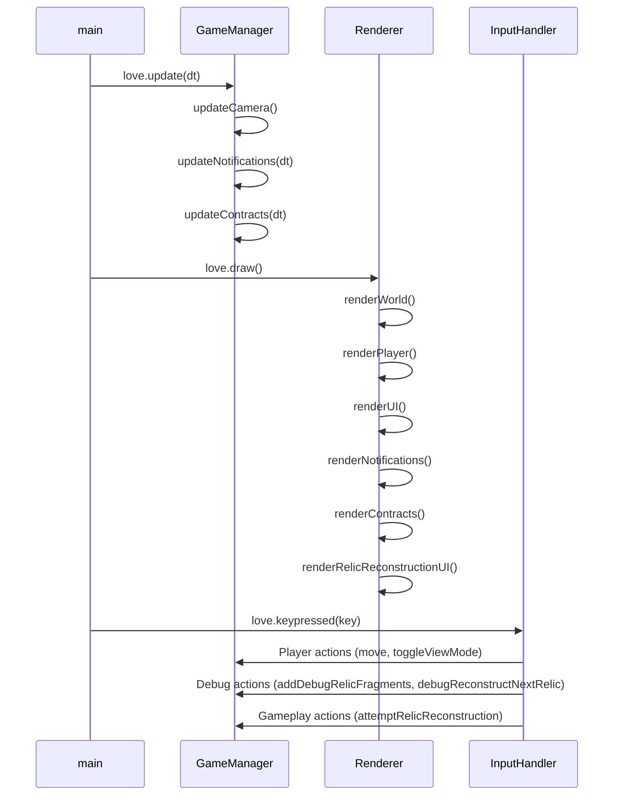

### **SYSTEM PATTERNS: "SHATTERED EXPANSE"**

---

### **ARCHITECTURE OVERVIEW**
```mermaid
graph TD
    A[Love2D Engine] --> B[main.lua]
    B --> C[GameManager]
    B --> D[InputHandler]
    B --> E[Renderer]
    
    C --> F[WorldGeneration]
    C --> G[AbilitySystem]
    C --> H[ContractSystem]
    C --> I[GameConfig]

    D --> C
    E --> C
    E --> I # Renderer uses GameConfig for UI positioning

    F --> I
    G --> I
    H --> F
    
    subgraph GameManager_Functions
        direction LR
        C_init[initialize]
        C_save[saveGame]
        C_load[loadGame]
        C_death[onPlayerDeath]
        C_move[movePlayer]
        C_attempt_relic[attemptRelicReconstruction]
        C_debug_frags[addDebugRelicFragments]
        C_debug_relic[debugReconstructNextRelic]
    end
    C --> C_init
    C --> C_save
    C --> C_load
    C --> C_death
    C --> C_move
    C --> C_attempt_relic
    C --> C_debug_frags
    C --> C_debug_relic

    subgraph InputHandler_Calls
        direction LR
        IH_move[handleKeyPress_Move]
        IH_relic_attempt[handleKeyPress_RelicAttempt]
        IH_debug_frags[handleKeyPress_DebugFrags]
        IH_debug_relic[handleKeyPress_DebugRelic]
    end
    D --> IH_move
    D --> IH_relic_attempt
    D --> IH_debug_frags
    D --> IH_debug_relic
    IH_move --> C_move
    IH_relic_attempt --> C_attempt_relic
    IH_debug_frags --> C_debug_frags
    IH_debug_relic --> C_debug_relic

    subgraph Renderer_Functions
        direction LR
        R_render[render]
        R_world[renderWorld]
        R_player[renderPlayer]
        R_ui[renderUI]
        R_relic_ui[renderRelicReconstructionUI]
        R_notifs[renderNotifications]
        R_contracts[renderContracts]
    end
    E --> R_render
    R_render --> R_world
    R_render --> R_player
    R_render --> R_ui
    R_render --> R_relic_ui
    R_render --> R_notifs
    R_render --> R_contracts
    
    subgraph Configuration
        I[GameConfig]
    end
    
    C --> I
    D --> C
    E --> C
    F --> I
    G --> I
    C --> H[ContractSystem]
    
    subgraph Configuration
        I[GameConfig]
    end
    
    C --> I
    D --> C
    E --> C
    F --> I
    G --> I
    H --> F
```

The codebase now follows a modular architecture with clear separation of concerns:

```
/
├── lib/                      # External libraries and dependencies
│   ├── perlin.lua            # Perlin noise implementation for procedural generation
│   └── serpent.lua           # Serialization library for save/load
├── src/                      # Source code
│   ├── config/               # Configuration settings
│   │   └── game_config.lua   # Centralized game constants and settings
│   ├── core/                 # Core game systems
│   │   └── game_manager.lua  # Game state and management
│   ├── input/                # Input handling
│   │   └── input_handler.lua # Processes user input
│   ├── rendering/            # Rendering systems
│   │   └── renderer.lua      # Handles all rendering operations
│   ├── systems/              # Game systems
│   │   ├── ability_system.lua # Player abilities and effects
│   │   └── contract_system.lua # Contract generation and management
│   ├── world/                # World-related code
│   │   └── world_generation.lua # Procedural world generation
│   └── ui/                   # User interface components
├── main.lua                  # Entry point and LÖVE callbacks
└── documentation/            # Documentation files
    └── ai_development_guide.md # Developer guide
```

---

### **KEY TECHNICAL DECISIONS**
1. **Modular Architecture**
   - Separation of concerns with focused modules
   - Centralized configuration in game_config.lua
   - Explicit module dependencies for better traceability
   - Comprehensive documentation for AI maintainability

2. **Procedural Generation**
   - Enhanced Perlin noise implementation for biome distribution
   - Random landmark placement with walkability checks
   - Tile-based world representation (100x100 grid)
   - Configurable generation parameters

3. **Game State Management**
   - Centralized `GameState` table within GameManager, which includes `meta.relics` (for status) and `meta.relic_fragments` (for collected counts).
   - Separation of run-specific state (e.g., `player.inventory.relic_fragments`) and persistent meta-state.
   - Serialization using Serpent library for `GameState.meta`.
   - Clear state update functions, including robust `loadGame` merging and `onPlayerDeath` fragment persistence.

4. **Progression Systems**
   - Relic reconstruction is a functional long-term goal, allowing players to spend collected fragments to complete relics.
   - Exploration-focused ability unlocks
   - Contract rewards tied to progression
   - Meta-progression across gameplay sessions

5. **Systems Design**
   - Decoupled systems: Movement, Hazard, Contract, Progression, Ability
   - Event-driven hazard system triggered on movement
   - Observer pattern for contract completion events
   - Factory pattern for ability effects

6. **Rendering Architecture**
   - Dedicated Renderer module with specialized rendering functions including `renderRelicReconstructionUI`.
   - Clear separation between game logic and presentation.
   - Organized rendering of world, player, UI (general, relic, notifications, contracts).

---

### **DESIGN PATTERNS**
1. **Module Pattern**
   - Each component is a self-contained Lua module
   - Public API exposed through returned table
   - Private functions kept within module scope
   - Example: 
   ```lua
   local MyModule = {}
   function MyModule.publicFunction() end
   local function privateFunction() end
   return MyModule
   ```

2. **Centralized State Management**
   - GameManager.GameState serves as the source of truth
   - Components read from but don't directly modify state
   - State modifications go through GameManager functions
   - Prevents state inconsistencies and race conditions

3. **Centralized Configuration**
   - All constants and magic numbers in game_config.lua
   - Organized by domain (WORLD, PLAYER, HAZARDS, UI)
   - Makes tweaking game parameters easier
   - Improves maintainability by removing hardcoded values

4. **Observer Pattern**
   - Contract system observes player discoveries
   - Hazard system observes player movement
   - Ability system observes player actions
   - Notification system for game events

5. **Strategy Pattern**
   - Different hazard implementations per biome
   - Different contract types with unique completion criteria
   - Configurable ability effects
   - Flexible rendering strategies based on view mode

6. **Factory Pattern**
   - Generates contract rewards (relic fragments, abilities)
   - Creates ability effect implementations
   - Procedurally generates world features

---

### **CRITICAL IMPLEMENTATION PATHS**
1. **Initialization Flow**


2. **Game Loop Execution**


3. **Player Movement Flow**


4. **Contract System Flow**


5. **Death and Persistence Flow**
```mermaid
flowchart TD
    A[Stamina <= 0] --> B[GameManager.onPlayerDeath]
    B --> C[Save relic fragments to meta]
    C --> D[Save discovered landmarks]
    D --> E[GameManager.saveGame]
    E --> F[Reset world/player]
    F --> G[Load persistent abilities]
    G --> H[Reset contracts]
    H --> I[Continue game]

6. **Relic Reconstruction Flow**
```mermaid
sequenceDiagram
    InputHandler->>GameManager: love.keypressed("r") (attemptRelicReconstruction)
    GameManager->>GameManager: Iterate meta.relics
    loop For each non-reconstructed relic
        GameManager->>GameManager: Check player.inventory.relic_fragments vs relic.fragments
        alt Enough Fragments
            GameManager->>GameManager: Deduct fragments from player.inventory
            GameManager->>GameManager: Set relic.reconstructed = true
            GameManager->>GameManager: addNotification("Relic X reconstructed!")
            Note over GameManager: (Future: Apply relic effects/abilities)
            GameManager-->>InputHandler: return true (stop iteration)
        else Not Enough Fragments
            GameManager->>GameManager: Continue to next relic
        end
    end
    alt No suitable relic found or all reconstructed
        GameManager->>GameManager: addNotification("Cannot reconstruct / All done.")
        GameManager-->>InputHandler: return false
    end
```
